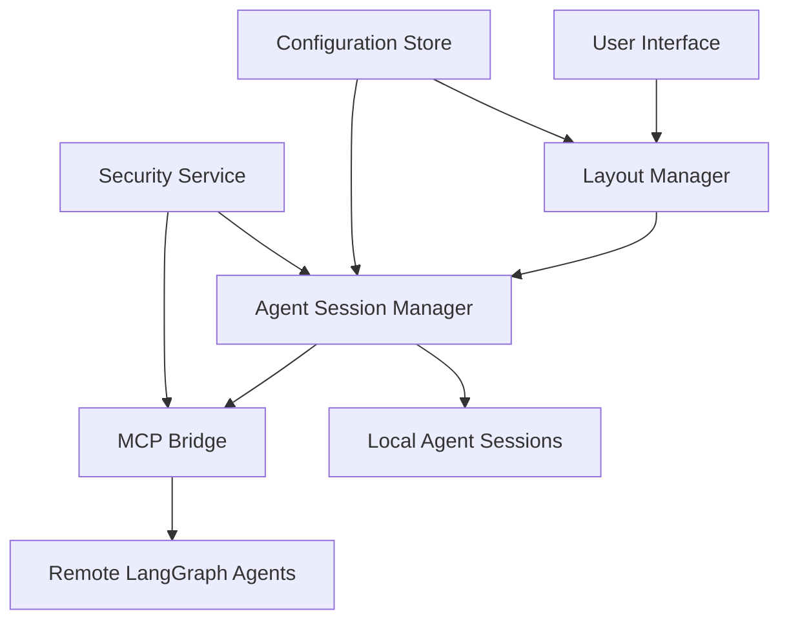

# Orchestrator Hub Architecture: Desktop App Transformation Plan

## Executive Summary

This document outlines the architectural transformation of the desktop application from a single-agent interface to a comprehensive orchestrator hub. The new system will enable users to connect, manage, and interact with multiple agents, tools, notifications, and data sources through advanced layout customization.

## 1. System Architecture Overview

### 1.1 Core Components

#### Orchestrator Core Engine
- **Purpose**: Central coordination point for all agent interactions
- **Responsibilities**:
  - Agent lifecycle management
  - Message routing and dispatch
  - Session state synchronization
  - Cross-agent communication facilitation

#### Agent Management Layer
- **Agent Registry**: Centralized catalog of available agents
- **Session Manager**: Handles creation, destruction, and switching of agent sessions
- **Connection Pool**: Manages persistent connections to remote agents
- **Health Monitor**: Continuous monitoring of agent availability and performance

#### Layout Management System
- **Layout Engine**: Dynamic pane creation and arrangement
- **State Persistence**: Save/restore user layouts and configurations
- **Responsive Design**: Adaptive layouts for different screen sizes
- **Custom Layout Builder**: User-defined layout creation tools

#### Communication Layer
- **MCP Protocol**: Standardized communication with LangGraph agents
- **WebSocket Manager**: Real-time bidirectional communication
- **Message Queue**: Asynchronous message handling for scalability
- **Event Bus**: System-wide event distribution

### 1.2 Technology Stack

#### Frontend Architecture
```
┌─────────────────────────────────────────┐
│           React/Electron              │
├─────────────────────────────────────────┤
│        Layout Management              │
├─────────────────────────────────────────┤
│        Agent Interface                │
├─────────────────────────────────────────┤
│        State Management               │
└─────────────────────────────────────────┘
```

#### Backend Services
```
┌─────────────────────────────────────────┐
│        MCP Bridge Service              │
├─────────────────────────────────────────┤
│        Agent Session Manager           │
├─────────────────────────────────────────┤
│        Configuration Service           │
├─────────────────────────────────────────┤
│        Security & Auth Service          │
└─────────────────────────────────────────┘
```

### 1.3 Data Flow Architecture



## 2. Component Architecture

### 2.1 Agent Management Module

#### Agent Registry Service
```typescript
interface AgentRegistry {
  listAgents(): Promise<AgentDescriptor[]>
  registerAgent(agent: AgentDescriptor): Promise<void>
  unregisterAgent(id: string): Promise<void>
  discoverRemoteAgents(endpoint: string): Promise<AgentDescriptor[]>
}

interface AgentDescriptor {
  id: string
  name: string
  type: 'remote' | 'local' | 'langgraph'
  capabilities: string[]
  endpoint?: string
  authentication?: AuthConfig
}
```

#### Session Management
```typescript
interface SessionManager {
  createSession(agentId: string, layoutId: string): Promise<Session>
  destroySession(sessionId: string): Promise<void>
  switchSession(sessionId: string): Promise<void>
  getActiveSessions(): Promise<Session[]>
  suspendSession(sessionId: string): Promise<void>
  resumeSession(sessionId: string): Promise<void>
}
```

### 2.2 Layout Management System

#### Layout Types
- **Single Pane**: Traditional single conversation view
- **Split View**: Two-pane side-by-side arrangement
- **Grid Layout**: 2x2 or 3x3 matrix arrangement
- **Custom Layout**: User-defined free-form arrangement
- **Responsive Layout**: Adaptive to window size changes

#### Layout State Schema
```json
{
  "layout": {
    "type": "grid-2x2",
    "panes": [
      {
        "id": "pane-1",
        "agentId": "langgraph:agent-1",
        "position": {"x": 0, "y": 0, "w": 1, "h": 1},
        "state": "active"
      }
    ],
    "settings": {
      "showTabs": true,
      "showHeaders": true,
      "synchronizedScrolling": false
    }
  }
}
```

### 2.3 Communication Protocols

#### MCP Protocol Implementation
```typescript
interface MCPConnection {
  connect(endpoint: string, auth?: AuthConfig): Promise<void>
  disconnect(): Promise<void>
  sendMessage(message: MCPMessage): Promise<MCPResponse>
  subscribe(event: string, handler: EventHandler): void
  getCapabilities(): Promise<Capability[]>
}

interface MCPMessage {
  type: 'request' | 'response' | 'notification'
  method: string
  params: any
  id?: string
}
```

## 3. Security Architecture

### 3.1 Authentication & Authorization
- **OAuth2 Flow**: Support for OAuth2 with LangGraph
- **API Key Management**: Secure storage and rotation
- **Token Storage**: OS-native keychain integration
- **Session Isolation**: Per-agent session isolation

### 3.2 Security Measures
- **Input Validation**: All agent inputs sanitized
- **Sandboxing**: Agent execution in isolated environments
- **Rate Limiting**: Prevent abuse of remote agents
- **Audit Logging**: Comprehensive security event logging

## 4. Scalability Considerations

### 4.1 Performance Targets
- **Agent Switching**: <100ms latency
- **Layout Changes**: <200ms re-rendering
- **Connection Recovery**: <5 seconds for failed connections
- **Memory Usage**: <200MB for 8 concurrent agents

### 4.2 Resource Management
- **Connection Pooling**: Reuse connections to remote agents
- **Lazy Loading**: Load agents on demand
- **Resource Cleanup**: Automatic cleanup of inactive sessions
- **Caching Strategy**: Intelligent caching of agent responses

## 5. Integration Points

### 5.1 External System Integrations
- **LangGraph Agents**: Full MCP protocol support
- **Custom MCP Servers**: Extensible for custom agents
- **Notification Systems**: Cross-agent notification hub
- **Data Sources**: Integration with external APIs and databases

### 5.2 Plugin Architecture
```typescript
interface PluginAPI {
  registerAgent(agent: AgentDescriptor): void
  registerLayout(layout: LayoutDefinition): void
  registerNotificationHandler(handler: NotificationHandler): void
  getConfiguration(): Promise<Configuration>
  setConfiguration(config: Configuration): Promise<void>
}
```

## 6. Migration Strategy

### 6.1 Phased Rollout
- **Phase 1**: Single agent with new architecture
- **Phase 2**: Multi-agent support with basic layouts
- **Phase 3**: Advanced layouts and customization
- **Phase 4**: Full orchestrator hub features

### 6.2 Backward Compatibility
- **Legacy Mode**: Support for single-agent interface
- **Data Migration**: Migrate existing configurations
- **Feature Flags**: Gradual feature rollout

## 7. Monitoring & Observability

### 7.1 Metrics Collection
- **Agent Performance**: Response times, error rates
- **System Health**: Memory usage, CPU utilization
- **User Engagement**: Layout usage patterns, agent preferences
- **Connection Quality**: Network latency, connection stability

### 7.2 Health Monitoring
- **Agent Health Checks**: Periodic connectivity tests
- **Performance Monitoring**: Real-time performance tracking
- **Error Tracking**: Comprehensive error logging and alerting
- **User Feedback**: In-app feedback mechanisms

## 8. Future Roadmap

### 8.1 Near-term (3-6 months)
- Agent marketplace integration
- Advanced notification system
- Multi-device synchronization
- Custom agent creation tools

### 8.2 Long-term (6-12 months)
- AI-powered layout suggestions
- Collaborative agent sessions
- Advanced workflow automation
- Enterprise features (SSO, audit logs)