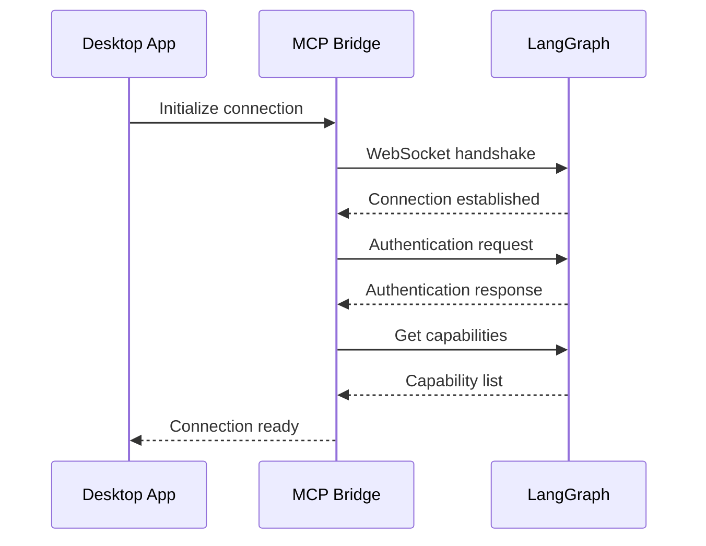

# LangGraph MCP Integration Specification

## Overview

This document specifies the integration protocol for connecting the desktop application to LangGraph remote agents using the Model Context Protocol (MCP). The integration enables seamless communication between the orchestrator hub and distributed LangGraph agents.

## 1. Protocol Specification

### 1.1 MCP Protocol Version
- **Version**: MCP 1.0
- **Transport**: WebSocket over HTTPS
- **Message Format**: JSON-RPC 2.0
- **Authentication**: OAuth2 + Bearer tokens

### 1.2 Connection Establishment

#### Handshake Flow


#### Connection States
```typescript
enum ConnectionState {
  DISCONNECTED = 'disconnected',
  CONNECTING = 'connecting',
  AUTHENTICATING = 'authenticating',
  CONNECTED = 'connected',
  READY = 'ready',
  ERROR = 'error'
}
```

### 1.3 Authentication Flow

#### OAuth2 Integration
```typescript
interface OAuth2Config {
  clientId: string
  clientSecret?: string
  authorizationEndpoint: string
  tokenEndpoint: string
  redirectUri: string
  scopes: string[]
}

interface TokenResponse {
  accessToken: string
  refreshToken: string
  expiresIn: number
  tokenType: string
}
```

#### API Key Authentication
```typescript
interface ApiKeyAuth {
  type: 'api-key'
  key: string
  header?: string
  prefix?: string
}

interface BearerTokenAuth {
  type: 'bearer'
  token: string
}
```

## 2. LangGraph Agent Discovery

### 2.1 Agent Registry Endpoint
```typescript
interface AgentRegistryEndpoint {
  url: string
  method: 'GET'
  headers: Record<string, string>
  response: AgentDescriptor[]
}

interface AgentDescriptor {
  id: string
  name: string
  description: string
  version: string
  capabilities: Capability[]
  endpoint: string
  supportedProtocols: string[]
  metadata: Record<string, any>
}
```

### 2.2 Capability Discovery
```typescript
interface Capability {
  name: string
  type: 'tool' | 'resource' | 'prompt'
  description: string
  parameters?: ParameterDefinition[]
  returns?: ReturnTypeDefinition
}

interface ParameterDefinition {
  name: string
  type: 'string' | 'number' | 'boolean' | 'object' | 'array'
  required: boolean
  description?: string
  default?: any
  constraints?: Record<string, any>
}
```

## 3. Message Protocol

### 3.1 Request/Response Format
```typescript
interface MCPRequest {
  jsonrpc: '2.0'
  id: string | number
  method: string
  params?: any
}

interface MCPResponse {
  jsonrpc: '2.0'
  id: string | number
  result?: any
  error?: MCPError
}

interface MCPError {
  code: number
  message: string
  data?: any
}
```

### 3.2 Agent Communication Methods

#### Tool Execution
```typescript
interface ToolCallRequest {
  method: 'tools/call'
  params: {
    name: string
    arguments: Record<string, any>
  }
}

interface ToolCallResponse {
  result: {
    content: Array<{
      type: 'text' | 'image' | 'json'
      data: any
    }>
  }
}
```

#### Resource Access
```typescript
interface ResourceRequest {
  method: 'resources/read'
  params: {
    uri: string
  }
}

interface ResourceResponse {
  result: {
    contents: Array<{
      uri: string
      mimeType: string
      data: string
    }>
  }
}
```

#### Prompt Templates
```typescript
interface PromptRequest {
  method: 'prompts/get'
  params: {
    name: string
    arguments?: Record<string, any>
  }
}

interface PromptResponse {
  result: {
    description: string
    messages: Array<{
      role: 'user' | 'assistant' | 'system'
      content: {
        type: 'text' | 'image'
        text?: string
        data?: string
      }
    }>
  }
}
```

## 4. Error Handling & Recovery

### 4.1 Error Categories
```typescript
enum ErrorCategory {
  NETWORK = 'network',
  AUTHENTICATION = 'authentication',
  AGENT_UNAVAILABLE = 'agent_unavailable',
  RATE_LIMIT = 'rate_limit',
  TIMEOUT = 'timeout',
  INVALID_REQUEST = 'invalid_request'
}

interface ErrorHandlingStrategy {
  retry: boolean
  maxRetries: number
  backoff: 'linear' | 'exponential' | 'fixed'
  fallback?: string
}
```

### 4.2 Retry Strategies
```typescript
interface RetryConfig {
  maxRetries: number
  initialDelay: number
  maxDelay: number
  backoffMultiplier: number
  retryableErrors: string[]
}

class RetryPolicy {
  async execute<T>(
    operation: () => Promise<T>,
    config: RetryConfig
  ): Promise<T> {
    // Implementation with exponential backoff
  }
}
```

## 5. Security Implementation

### 5.1 Token Management
```typescript
interface TokenManager {
  storeToken(agentId: string, token: TokenResponse): Promise<void>
  getToken(agentId: string): Promise<TokenResponse | null>
  refreshToken(agentId: string): Promise<TokenResponse>
  revokeToken(agentId: string): Promise<void>
  listTokens(): Promise<Array<{agentId: string, expiresAt: Date}>>
}
```

### 5.2 Secure Storage
```typescript
interface SecureStorage {
  setItem(key: string, value: string): Promise<void>
  getItem(key: string): Promise<string | null>
  removeItem(key: string): Promise<void>
  clear(): Promise<void>
}

// Platform-specific implementations
class KeychainStorage implements SecureStorage {
  // macOS Keychain implementation
}

class WindowsCredentialManager implements SecureStorage {
  // Windows Credential Manager implementation
}
```

## 6. Connection Pooling

### 6.1 Connection Management
```typescript
interface ConnectionPool {
  acquire(agentId: string): Promise<MCPConnection>
  release(connection: MCPConnection): Promise<void>
  close(agentId: string): Promise<void>
  getStats(): Promise<ConnectionStats>
}

interface ConnectionStats {
  totalConnections: number
  activeConnections: number
  idleConnections: number
  pendingRequests: number
}
```

### 6.2 Health Monitoring
```typescript
interface HealthMonitor {
  checkConnection(agentId: string): Promise<HealthStatus>
  startMonitoring(agentId: string, interval: number): void
  stopMonitoring(agentId: string): void
  onHealthChange(handler: (agentId: string, status: HealthStatus) => void): void
}

interface HealthStatus {
  status: 'healthy' | 'degraded' | 'unhealthy'
  responseTime: number
  lastCheck: Date
  errorRate: number
}
```

## 7. Rate Limiting

### 7.1 Rate Limit Configuration
```typescript
interface RateLimitConfig {
  requestsPerSecond: number
  burstCapacity: number
  cooldownPeriod: number
  perMethodLimits?: Record<string, number>
}

class RateLimiter {
  async checkLimit(method: string, agentId: string): Promise<boolean>
  async getRetryAfter(method: string, agentId: string): Promise<number>
}
```

## 8. Configuration Schema

### 8.1 Agent Configuration
```json
{
  "agentId": "langgraph:research-agent",
  "endpoint": "wss://api.langgraph.com/v1/agents/research",
  "authentication": {
    "type": "oauth2",
    "clientId": "desktop-app",
    "scopes": ["read", "write"]
  },
  "connection": {
    "timeout": 30000,
    "retryPolicy": {
      "maxRetries": 3,
      "backoff": "exponential"
    }
  },
  "capabilities": [
    "tools/call",
    "resources/read",
    "prompts/get"
  ]
}
```

### 8.2 Global Configuration
```json
{
  "mcp": {
    "maxConcurrentConnections": 10,
    "connectionTimeout": 30000,
    "heartbeatInterval": 30000,
    "rateLimit": {
      "enabled": true,
      "requestsPerSecond": 10,
      "burstCapacity": 20
    }
  },
  "security": {
    "tokenRefreshBuffer": 300,
    "maxTokenAge": 3600,
    "secureStorage": true
  }
}
```

## 9. Testing Specification

### 9.1 Connection Tests
```typescript
interface ConnectionTestSuite {
  testHandshake(): Promise<boolean>
  testAuthentication(): Promise<boolean>
  testCapabilityDiscovery(): Promise<boolean>
  testErrorRecovery(): Promise<boolean>
  testRateLimiting(): Promise<boolean>
  testConcurrentConnections(): Promise<boolean>
}
```

### 9.2 Mock Implementations
```typescript
class MockLangGraphServer {
  // Test double for LangGraph endpoints
  // Simulates various scenarios: success, failure, rate limits
}

class MCPTestHarness {
  // Integration testing framework
  // Validates protocol compliance
}
```

## 10. Migration Checklist

### 10.1 Prerequisites
- [ ] MCP client library integration
- [ ] OAuth2 flow implementation
- [ ] Secure storage backend
- [ ] Connection pooling setup
- [ ] Health monitoring service
- [ ] Rate limiting implementation

### 10.2 Validation Steps
- [ ] Connection establishment test
- [ ] Agent discovery test
- [ ] Tool execution test
- [ ] Resource access test
- [ ] Error handling test
- [ ] Security audit
- [ ] Performance benchmarks

## 11. API Reference

### 11.1 Connection Management API
```typescript
class LangGraphConnector {
  async connect(config: AgentConfig): Promise<MCPConnection>
  async disconnect(agentId: string): Promise<void>
  async getConnection(agentId: string): Promise<MCPConnection | null>
  async listConnections(): Promise<string[]>
  async getConnectionStatus(agentId: string): Promise<ConnectionStatus>
}
```

### 11.2 Agent Discovery API
```typescript
class AgentDiscoveryService {
  async discoverAgents(endpoint: string): Promise<AgentDescriptor[]>
  async validateAgent(agentId: string): Promise<boolean>
  async getAgentCapabilities(agentId: string): Promise<Capability[]>
}
```

This specification provides the complete technical foundation for integrating LangGraph remote agents using the MCP protocol, ensuring secure, reliable, and scalable communication between the desktop orchestrator hub and distributed agent networks.