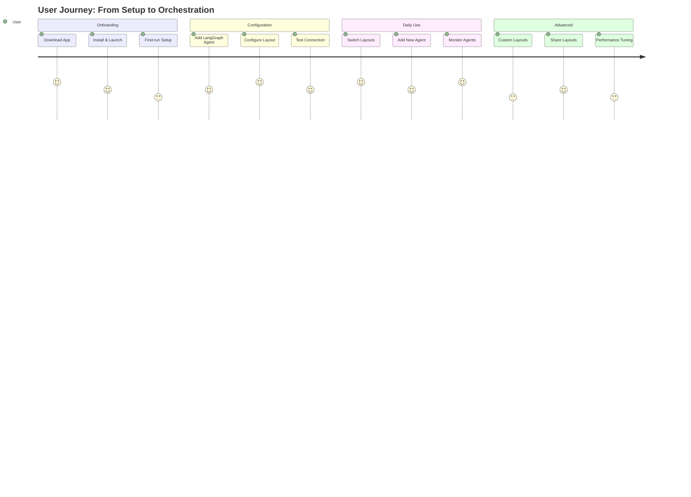

# UX Wireframes and Interaction Specifications

## Overview

This document provides detailed user experience (UX) wireframes and interaction specifications for transforming the desktop application into a comprehensive orchestrator hub. It covers the complete user journey from initial setup to advanced multi-agent management.

## 1. User Journey Mapping

### 1.1 Primary User Personas

#### Power User - "Alex"
- **Goal**: Manage 4-8 concurrent agents for complex workflows
- **Needs**: Advanced layout customization, keyboard shortcuts, performance optimization
- **Pain Points**: Context switching between agents, information overload

#### Researcher - "Sarah"
- **Goal**: Compare outputs from different AI agents
- **Needs**: Side-by-side comparisons, synchronized interactions
- **Pain Points**: Manual copying between conversations, inconsistent layouts

#### Developer - "Marcus"
- **Goal**: Integrate custom agents and monitor performance
- **Needs**: Agent registry, connection management, debugging tools
- **Pain Points**: Complex configuration, lack of visibility into agent status

### 1.2 User Journey Flow



## 2. Screen-by-Screen Wireframes

### 2.1 Welcome & Onboarding Screens

#### 2.1.1 Welcome Screen
```
┌─────────────────────────────────────────────────────────────┐
│  [App Logo]  Orchestrator Hub                              │
│                                                             │
│  Welcome to your AI agent command center                    │
│                                                             │
│  ┌───────────────────────────────────────┐                 │
│  │  Quick Setup                          │                 │
│  │                                      │                 │
│  │  1. Connect your first agent        │                 │
│  │  2. Choose your layout              │                 │
│  │  3. Start orchestrating            │                 │
│  └───────────────────────────────────────┘                 │
│                                                             │
│  [Get Started →]  [Skip Setup]                            │
└─────────────────────────────────────────────────────────────┘
```

#### 2.1.2 Agent Discovery Screen
```
┌─────────────────────────────────────────────────────────────┐
│  Add Your First Agent                                       │
│                                                             │
│  ┌───────────────────────────────────────┐                 │
│  │  🔍 Search agents...               │                 │
│  └───────────────────────────────────────┘                 │
│                                                             │
│  Available Agents:                                          │
│  ┌───────────────────────────────────────┐                 │
│  │  [Logo] Research Agent              │  [Connect]      │
│  │  Advanced research & analysis       │                 │
│  └───────────────────────────────────────┘                 │
│  ┌───────────────────────────────────────┐                 │
│  │  [Logo] Code Agent                  │  [Connect]      │
│  │  Code generation & review           │                 │
│  └───────────────────────────────────────┘                 │
│  ┌───────────────────────────────────────┐                 │
│  │  [Logo] Data Agent                  │  [Connect]      │
│  │  Data analysis & insights           │                 │
│  └───────────────────────────────────────┘                 │
└─────────────────────────────────────────────────────────────┘
```

### 2.2 Main Application Interface

#### 2.2.1 Default Layout - Single Pane
```
┌─────────────────────────────────────────────────────────────┐
│  [File] [Edit] [View] [Agents] [Layout] [Help]            │
│  ┌─────────────────────────────────────────────────────────┐ │
│  │  Orchestrator Hub                          [Settings]  │ │
│  │                                                         │ │
│  │  ┌─────────────────────────────────────────────────┐   │ │
│  │  │  Research Agent                    [-][□][×]    │   │ │
│  │  │                                                 │   │ │
│  │  │  ┌─────────────────────────────────────────────┐ │   │ │
│  │  │  │  Welcome! How can I help you today?       │ │   │ │
│  │  │  │                                             │ │   │ │
│  │  │  │  [Type your message...]               [Send] │   │ │
│  │  │  └─────────────────────────────────────────────┘ │   │ │
│  │  └─────────────────────────────────────────────────┘   │ │
│  └─────────────────────────────────────────────────────────┘ │
│  Status: Connected to Research Agent                        │
└─────────────────────────────────────────────────────────────┘
```

#### 2.2.2 Split View Layout
```
┌─────────────────────────────────────────────────────────────┐
│  [File] [Edit] [View] [Agents] [Layout] [Help]            │
│  ┌─────────────────────────────────────────────────────────┐ │
│  │  Orchestrator Hub                          [Settings]  │ │
│  │                                                         │ │
│  │  ┌─────────────────────┬─────────────────────────────┐ │ │
│  │  │ Research Agent    │ Code Agent                  │ │ │
│  │  │   [-][□][×]       │   [-][□][×]               │ │ │
│  │  │                     │                           │ │ │
│  │  │ ┌─────────────────┐ │ ┌───────────────────────┐ │ │ │
│  │  │ │ Hello!          │ │ │ I'll help with code   │ │ │ │
│  │  │ │                 │ │ │                       │ │ │ │
│  │  │ │ [Message...]  │ │ │ [Message...]        │ │ │ │
│  │  │ └─────────────────┘ │ └───────────────────────┘ │ │ │
│  │  └─────────────────────┴─────────────────────────────┘ │ │
│  └─────────────────────────────────────────────────────────┘ │
│  Status: 2 agents active                                    │
└─────────────────────────────────────────────────────────────┘
```

#### 2.2.3 Grid 2x2 Layout
```
┌─────────────────────────────────────────────────────────────┐
│  [File] [Edit] [View] [Agents] [Layout] [Help]            │
│  ┌─────────────────────────────────────────────────────────┐ │
│  │  Orchestrator Hub                          [Settings]  │ │
│  │                                                         │ │
│  │  ┌─────────────┬─────────────┐                       │ │
│  │  │ Research    │ Code        │                       │ │
│  │  │ [-][□][×]   │ [-][□][×]   │                       │ │
│  │  │ ┌─────────┐ │ ┌─────────┐ │                       │ │
│  │  │ │ Output  │ │ │ Output  │ │                       │ │
│  │  │ │         │ │ │         │ │                       │ │
│  │  │ └─────────┘ │ └─────────┘ │                       │ │
│  │  ├─────────────┼─────────────┤                       │ │
│  │  │ Data        │ Analysis    │                       │ │
│  │  │ [-][□][×]   │ [-][□][×]   │                       │ │
│  │  │ ┌─────────┐ │ ┌─────────┐ │                       │ │
│  │  │ │ Output  │ │ │ Output  │ │                       │ │
│  │  │ └─────────┘ │ └─────────┘ │                       │ │
│  │  └─────────────┴─────────────┘                       │ │
│  └─────────────────────────────────────────────────────────┘ │
│  Status: 4 agents active                                    │
└─────────────────────────────────────────────────────────────┘
```

### 2.3 Agent Management Interface

#### 2.3.1 Agent Connection Dialog
```
┌─────────────────────────────────────────────────────────────┐
│  Connect to LangGraph Agent                               │
│                                                             │
│  Agent Name: [Research Pro________________]                 │
│                                                             │
│  Endpoint:   [wss://api.langgraph.com/agent/research____] │
│                                                             │
│  Authentication:                                            │
│  ○ OAuth2 (Recommended)                                   │
│  ○ API Key                                              │
│  ○ Bearer Token                                         │
│                                                             │
│  [Test Connection]                                        │
│                                                             │
│  Status: ✅ Connected                                     │
│                                                             │
│  [Cancel]              [Connect]                          │
└─────────────────────────────────────────────────────────────┘
```

#### 2.3.2 Agent Status Panel
```
┌─────────────────────────────────────────────────────────────┐
│  Active Agents                                              │
│                                                             │
│  ┌───────────────────────────────────────┐                 │
│  │  Research Agent                     │                 │
│  │  Status: ✅ Online                  │                 │
│  │  Last Response: 2 min ago         │                 │
│  │  [Disconnect] [Settings]          │                 │
│  └───────────────────────────────────────┘                 │
│  ┌───────────────────────────────────────┐                 │
│  │  Code Agent                        │                 │
│  │  Status: ⚠️ Rate Limited            │                 │
│  │  Retry in: 30s                   │                 │
│  │  [Force Retry] [Settings]        │                 │
│  └───────────────────────────────────────┘                 │
│  ┌───────────────────────────────────────┐                 │
│  │  Data Agent                        │                 │
│  │  Status: ❌ Disconnected           │                 │
│  │  Error: Connection timeout         │                 │
│  │  [Reconnect] [Settings]          │                 │
│  └───────────────────────────────────────┘                 │
└─────────────────────────────────────────────────────────────┘
```

### 2.4 Layout Customization

#### 2.4.1 Layout Builder
```
┌─────────────────────────────────────────────────────────────┐
│  Layout Builder                                             │
│                                                             │
│  ┌─────────────┬─────────────────────────────────────┐   │
│  │ Templates   │  Preview Area                        │   │
│  │             │                                     │   │
│  │  Single     │  ┌─────────┐                       │   │
│  │  Split      │  │         │                       │   │
│  │  Grid 2x2   │  │         │                       │   │
│  │  Grid 3x3   │  │         │                       │   │
│  │  Custom     │  │         │                       │   │
│  │             │  └─────────┘                       │   │
│  └─────────────┴─────────────────────────────────────┘   │
│                                                             │
│  [Save] [Apply] [Cancel]                                  │
└─────────────────────────────────────────────────────────────┘
```

#### 2.4.2 Drag-and-Drop Visual Feedback
```
┌─────────────────────────────────────────────────────────────┐
│  Active Layout                                            │
│                                                             │
│  ┌─────────────┬─────────────┐                           │
│  │ Research    │ Code        │                           │
│  │ [Drag...]   │             │                           │
│  │             │             │                           │
│  └─────────────┴─────────────┘                           │
│        ↓                                                    │
│  ┌─────────────┬─────────────┐                           │
│  │ Research    │ Code        │                           │
│  │             │ [Drop here] │                           │
│  │             │  ┌───────┐  │                           │
│  │             │  │Drag   │  │                           │
│  │             │  │Preview│  │                           │
│  └─────────────┴─────────────┘                           │
└─────────────────────────────────────────────────────────────┘
```

## 3. Interaction Specifications

### 3.1 Mouse Interactions

#### 3.1.1 Click Behaviors
| Element | Action | Result |
|---------|--------|--------|
| Pane Header | Single Click | Focus pane |
| Pane Header | Double Click | Maximize pane |
| Tab | Click | Switch active agent |
| Resize Handle | Click+Drag | Resize pane |
| Close Button | Click | Close pane with confirmation |

#### 3.1.2 Hover States
```css
.pane-header:hover {
  background: var(--hover-bg);
  cursor: move;
}

.resize-handle:hover {
  background: var(--resize-hover);
  cursor: col-resize;
}

.tab:hover {
  background: var(--tab-hover);
  border-bottom: 2px solid var(--accent);
}
```

### 3.2 Keyboard Shortcuts

#### Global Shortcuts
| Shortcut | Action |
|----------|--------|
| `Ctrl+Tab` | Next pane |
| `Ctrl+Shift+Tab` | Previous pane |
| `Ctrl+1-9` | Switch to pane 1-9 |
| `Ctrl+T` | New tab |
| `Ctrl+W` | Close tab |
| `Ctrl+N` | New pane |
| `Ctrl+R` | Reset layout |
| `Ctrl+L` | Open layout selector |
| `Ctrl+S` | Save current layout |

#### Pane-Specific Shortcuts
| Shortcut | Action |
|----------|--------|
| `Ctrl+M` | Minimize/Maximize pane |
| `Ctrl+D` | Duplicate pane |
| `Ctrl+P` | Pop out to new window |
| `Alt+Arrow` | Resize pane |

### 3.3 Touch/Gesture Support

#### Touch Interactions
| Gesture | Action |
|---------|--------|
| Tap | Select pane |
| Double Tap | Maximize pane |
| Long Press | Open context menu |
| Swipe Left/Right | Switch tabs |
| Pinch | Zoom layout |
| Drag | Rearrange panes |

#### Gesture Recognition
```typescript
interface TouchGestureHandler {
  onTap(event: TouchEvent): void
  onDoubleTap(event: TouchEvent): void
  onLongPress(event: TouchEvent): void
  onSwipe(direction: string): void
  onPinch(scale: number): void
}
```

## 4. Responsive Behavior

### 4.1 Breakpoint Behaviors

#### Mobile (< 600px)
- Single pane only
- Swipe navigation between agents
- Collapsible sidebar
- Touch-friendly buttons (44x44px minimum)

#### Tablet (600-900px)
- Split view supported
- Horizontal scrolling for multiple agents
- Context menus for actions
- Gesture-based navigation

#### Desktop (> 900px)
- Full layout support
- Keyboard shortcuts active
- Drag-and-drop enabled
- Right-click context menus

### 4.2 Orientation Handling

#### Landscape Mode
- Maximize horizontal space
- Grid layouts preferred
- Side-by-side comparisons

#### Portrait Mode
- Stack-based layouts
- Single pane focus
- Vertical scrolling

## 5. Visual Design Tokens

### 5.1 Color System
```css
:root {
  /* Primary Colors */
  --primary: #2563eb;
  --primary-hover: #1d4ed8;
  --primary-light: #dbeafe;
  
  /* Layout Colors */
  --pane-bg: #ffffff;
  --pane-border: #e5e7eb;
  --pane-header: #f9fafb;
  --resize-handle: #9ca3af;
  
  /* Status Colors */
  --success: #10b981;
  --warning: #f59e0b;
  --error: #ef4444;
  --info: #3b82f6;
  
  /* Text Colors */
  --text-primary: #111827;
  --text-secondary: #6b7280;
  --text-muted: #9ca3af;
}
```

### 5.2 Spacing System
```css
:root {
  --spacing-xs: 0.25rem;   /* 4px */
  --spacing-sm: 0.5rem;    /* 8px */
  --spacing-md: 1rem;      /* 16px */
  --spacing-lg: 1.5rem;    /* 24px */
  --spacing-xl: 2rem;      /* 32px */
  --spacing-2xl: 3rem;      /* 48px */
}
```

### 5.3 Typography
```css
:root {
  --font-family: -apple-system, BlinkMacSystemFont, 'Segoe UI', Roboto;
  --font-size-xs: 0.75rem;    /* 12px */
  --font-size-sm: 0.875rem;   /* 14px */
  --font-size-base: 1rem;     /* 16px */
  --font-size-lg: 1.125rem;   /* 18px */
  --font-size-xl: 1.25rem;    /* 20px */
}
```

## 6. Accessibility Requirements

### 6.1 ARIA Labels
```html
<div role="application" aria-label="Orchestrator Hub">
  <div role="tablist" aria-label="Agent conversations">
    <div role="tab" aria-selected="true" aria-controls="pane-1">
      Research Agent
    </div>
  </div>
  
  <div role="tabpanel" aria-labelledby="tab-1" id="pane-1">
    <!-- Agent conversation content -->
  </div>
</div>
```

### 6.2 Screen Reader Support
- All interactive elements have descriptive labels
- Status changes announced via ARIA live regions
- Keyboard navigation fully supported
- High contrast mode compatible

### 6.3 High Contrast Mode
```css
@media (prefers-contrast: high) {
  .pane-border {
    border: 2px solid #000;
  }
  
  .resize-handle {
    background: #000;
    width: 4px;
  }
}
```

## 7. Error States and Feedback

### 7.1 Connection Errors
```
┌─────────────────────────────────────────────────────────────┐
│  Connection Failed                                          │
│                                                             │
│  Unable to connect to Research Agent                      │
│                                                             │
│  Error: Network timeout                                      │
│                                                             │
│  [Retry] [Configure] [Cancel]                             │
└─────────────────────────────────────────────────────────────┘
```

### 7.2 Layout Save/Load States
```
┌─────────────────────────────────────────────────────────────┐
│  Save Layout                                               │
│                                                             │
│  Layout Name: [My Research Layout________]                 │
│                                                             │
│  ✅ Layout saved successfully!                            │
│                                                             │
│  [Save] [Cancel]                                          │
└─────────────────────────────────────────────────────────────┘
```

This comprehensive UX specification provides the foundation for creating an intuitive, powerful, and accessible orchestrator hub that scales from simple single-agent use to complex multi-agent orchestration workflows.